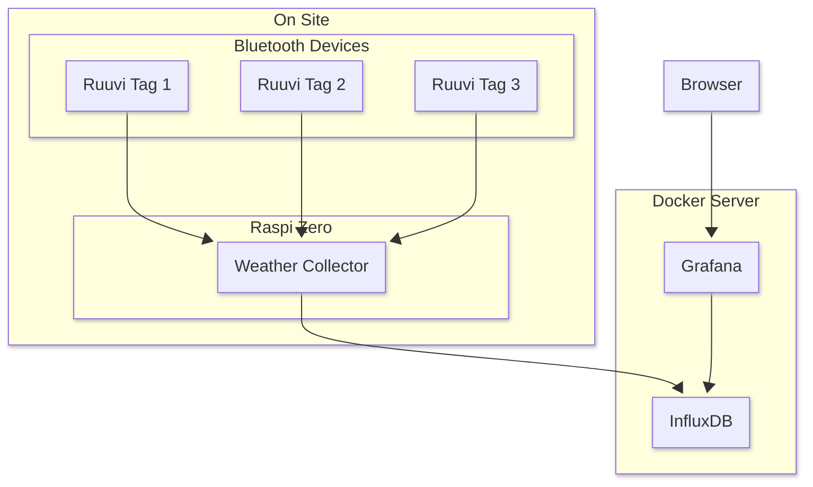

start docker compose.

# General architecture.


## Influx Data

point
-----

```
Measurement:     météo
Tags:            lieu=salon, capteur=DHT22
Fields:          temperature=23.4, humidite=45.8
Timestamp:       2025-06-13T10:15:00Z
```